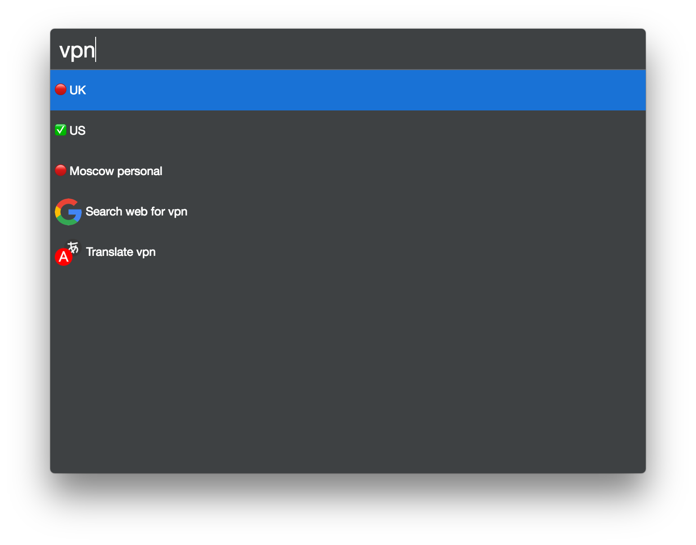

# cerebro-tunnelblick-system

> [Cerebro](https://cerebroapp.com) plugin to manage VPN connections in [Tunnelblick](https://tunnelblick.net/)

## Usage

In Cerebro, type `vpn` to see list of your VPN configurations and their statuses. Select configuration to connect or disconnect

## Related

- [Cerebro](http://github.com/KELiON/cerebro) – main repo for Cerebro app;

## License

MIT © [Alexandr Subbotin](http://asubbotin.ru)
